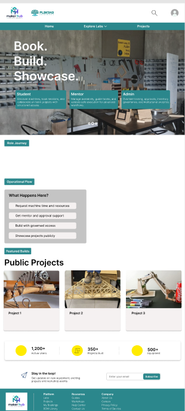
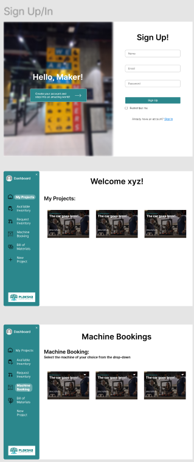

# Plaksha Labs Hub

**The unified platform for Plaksha makers — book equipment, build with mentors, showcase what you make.**

- **Author:** Suryaansh
- **Course:** ILGC
- **Institution:** Plaksha University
- **Date:** May 2026

---

## 1. Problem statement

Plaksha's hands-on culture lives across a growing constellation of labs — the Makerspace, the Robotics Lab, and more on the horizon. Each lab has its own equipment, its own mentors, its own intake forms, and its own way of remembering what students built last semester. Operationally, this fragmentation costs the institution in four concrete ways:

- **Booking lives in spreadsheets and WhatsApp.** A student wanting time on a laser cutter, a 3D printer, or a robotics rig has to chase availability across channels. Mentors arbitrate conflicts manually.
- **Inventory is invisible.** When a student needs M3 standoffs or a stepper driver, there is no single source of truth for what's in stock, where it is, or who used the last one. Procurement requests sit in inboxes.
- **Mentor and admin workflows are manual.** Approvals for Bills of Materials, training sign-offs, and machine certifications travel by email. Bottlenecks are invisible until a deadline slips.
- **Student work disappears.** Some of the most impressive builds at Plaksha live only on a personal Notion page or a poster that comes down after demo day. There is no institutional showcase that compounds the brand of Plaksha as a maker school.

**Plaksha Labs Hub** is built to close all four gaps inside one product.

---

## 2. Solution overview

Plaksha Labs Hub is a single web platform where every Plaksha lab is a first-class tenant. Students discover labs and showcased work through a public front, then sign in to book equipment, file material requests, run their projects with mentors, and publish what they make. Mentors and admins run the same flows from the other side — approvals, inventory, analytics, training records — without leaving the app.

The product organises around three pillars:

- **Book** — equipment availability, reservations, training prerequisites, and check-in/out for every lab from one calendar.
- **Build** — projects, teams, Bills of Materials, mentor availability, material requests, and procurement, all wired together so a project lead has one place to operate from.
- **Showcase** — a public landing page that surfaces featured builds, what happens inside Plaksha's labs, and a recruiting funnel for the next cohort of makers.

---

## 3. Core features delivered

- **Public landing experience.** Teal hero band, role-aware entry cards (Student / Mentor / Admin), featured projects, "What Happens Here?" cards, stats ring, newsletter capture, and a recruiting CTA strip.
- **Multi-role authentication.** NextAuth v5 supporting Microsoft Entra ID single sign-on for Plaksha accounts, an email + password fallback for invited accounts, and a development bypass for offline review.
- **Lab-scoped app shell.** Persistent deep-teal vertical sidebar (240px) with a lab switcher, role-aware navigation, a yellow accent "+ New Project" pill, and a top header carrying search, notifications, and the user avatar.
- **Machine booking + inventory requests.** Calendar-driven booking with training prerequisites enforced, plus an inventory request workflow that walks from student submission through mentor review to admin approval.
- **Bills of Materials + procurement chain.** Project leads draft a BoM, submit for approval, and watch it flow through `BOM submitted → BOM approved → Material request approved → Issued` with notifications at every hop.
- **Mentor availability, notifications, admin analytics, training records.** First-class entities for everything the operations team currently runs out of email.
- **Robotics Lab module.** Robotics ships alongside the Makerspace as a fully separate lab tenant with its own divisions, assets, and dashboard — proving the multi-lab model.
- **Light / dark theme, mobile responsive, WCAG-AA accessibility.** Focus rings, skip-to-content links, contrast tested against the teal and yellow palette, and respect for `prefers-reduced-motion`.

---

## 4. Architecture

```
┌──────────────────────────────────────────────────────────────────────┐
│                         BROWSER (any device)                          │
└──────────────────────────────────────────────────────────────────────┘
                                  │
                                  ▼
┌──────────────────────────────────────────────────────────────────────┐
│                    Next.js 14 — App Router                            │
│                                                                       │
│   (public) route group              (app) route group                 │
│   ─────────────────────             ─────────────────────             │
│   /               landing           /dashboard                        │
│   /labs           directory         /labs/[slug]/...                  │
│   /projects       showcase          /projects/[id]/...                │
│   /sign-in        auth split        /admin/...                        │
│                                                                       │
│   Tailwind tokens + Once UI primitives + Radix components             │
└──────────────────────────────────────────────────────────────────────┘
                                  │
                  Server Actions (the API layer)
                                  │
                                  ▼
┌──────────────────────────────────────────────────────────────────────┐
│            NextAuth v5 (Credentials + Entra ID + dev bypass)          │
│            Authorisation: Role × LabRole × Lab tenancy                │
└──────────────────────────────────────────────────────────────────────┘
                                  │
                                  ▼
┌──────────────────────────────────────────────────────────────────────┐
│                     Prisma ORM  ──►  PostgreSQL                       │
│                                                                       │
│   Core:        User, Account, Session, Role                           │
│   Tenancy:     Lab, LabDivision, LabRole                              │
│   Equipment:   Machine, Asset, InventoryItem, Checkout                │
│   Work:        Project, ProjectMember, Bom, BomItem                   │
│   Flow:        Booking, MaterialRequest, ProcurementRequest           │
│   People ops:  MentorAvailability, Training, Notification             │
└──────────────────────────────────────────────────────────────────────┘
```

The architecture deliberately keeps **Server Actions as the only API surface**. There is no separate REST or GraphQL layer to maintain; mutations are co-located with the components that trigger them, and authorisation is checked once at the action boundary against the session and the user's `LabRole` for the requested tenant.

---

## 5. Design system

The product pivoted on 2026-05-21 to a **teal primary, yellow accent, light-mode default** palette aligned with the Figma direction. The teal anchors the institutional voice; the yellow is reserved for moments that should pull the eye — the "+ New Project" pill, the stats ring on the landing page, the active navigation indicator.

**Figma reference — public landing**



**Figma reference — sign-in and dashboard**



### Token map

| Token | Hex | Role |
|---|---|---|
| Primary (teal) | `#0F8E92` | Hero band, primary CTAs, focus ring |
| Deep teal (sidebar) | `#0C6E71` | App shell sidebar, footer |
| Yellow accent | `#FFD43B` | New-project pill, stat ring, active indicator |
| Brand leaf green | `#5BAA5B` | Plaksha logo leaf, success states |
| Surface muted | `#EEEEEE` | "What Happens Here?" section, footer strip |
| Background | `#F5F7FA` | Page background (light mode default) |
| Foreground | `#17202A` | Body text |
| Card | `#FFFFFF` | Card surfaces |
| Border | `#DDEAF3` | Subtle separators |

### Motion principles

- **Scroll-reveal entrances.** Content rises into view as the user scrolls, with subtle fade and translate.
- **Magnetic CTAs.** Primary buttons drift slightly toward the cursor inside their hit area, giving the interface a sense of response without becoming noisy.
- **Glow cards.** Featured project tiles carry a soft cursor-follow glow, so the showcase feels alive.
- **`prefers-reduced-motion` respected everywhere.** Every animation degrades to a static state for users who request it.

---

## 6. User journey — screen walkthrough

**Public landing.** A teal hero band carries the institutional headline and a magnetic CTA. Below, three role cards (Student, Mentor, Admin) route the visitor to the right sign-in flow. A CTA strip invites prospective students into the labs, "What Happens Here?" cards explain the Book / Build / Showcase loop, Featured Builds surface real student work, the stats ring summarises the year, and a newsletter capture sits above the deep-teal footer.

**Sign-in.** A split layout: on the left, a blurred teal gradient hosts a floating "Hello, Maker!" pill — instantly readable as Plaksha. On the right, a clean form offers Microsoft Entra ID single sign-on for Plaksha accounts, with email + password as the secondary path.

**App shell.** A persistent deep-teal vertical sidebar at 240px carries the Plaksha mark, a lab switcher (Makerspace ↔ Robotics ↔ future labs), and role-aware navigation. The "+ New Project" pill sits in yellow to invite action. The top header carries search, notifications with an unread badge, and the user avatar.

**Lab pages.** The Robotics Lab dashboard surfaces division toggles (e.g. ground robotics, drones), asset cards with live status, upcoming bookings, and recent project activity. The Makerspace catalog mirrors the same shell, scoped to its own equipment and inventory.

**Admin.** A material-request approval queue lets staff approve, partially issue, or reject in one screen, with the project context one click away. Analytics summarise utilisation, throughput, and bottlenecks per lab.

---

## 7. Tech stack

**Frontend**
- Next.js 14 (App Router) with React 18 and TypeScript
- Tailwind CSS with a custom HSL token system
- Once UI primitives, Radix UI for accessible behaviours, Lucide for iconography
- TanStack Query for client-side cache coordination

**Backend**
- Server Actions as the sole API surface
- Prisma ORM 6 against PostgreSQL
- NextAuth v5 (Microsoft Entra ID + Credentials + dev bypass)
- Zod for input validation, bcryptjs for credential hashing

**DevOps / tooling**
- Vercel-ready Next.js build; Prisma migrations checked in
- ESLint + Next config, TypeScript strict mode
- `tsx` for seed scripts, Sharp for image optimisation
- Figma Dev Mode MCP server for design handoff

---

## 8. Project timeline

**Phase 0 — Foundation**
- Initial repository, Next.js 14 scaffolding, providers, middleware, and the first auth pass.
- Email + password authentication wired for alpha testers, with hashed credentials seeded for demo users.
- Auth hardening across environments: shared JWT secret, cookie detection across dev and production, middleware token decoding.
- Production seeding documented; legacy transcripts removed.

**Phase 1 — Core flows**
- Plaksha Labs Hub multi-lab platform scaffolded: Lab, LabDivision, LabRole, Asset, InventoryItem, Checkout, ProcurementRequest joined the existing Makerspace schema.
- Engineering docs published: architecture, conventions, and ADRs.
- Prisma server actions wired end-to-end so projects, bookings, BoMs, material requests, and procurement run as functional flows rather than mocked screens.

**Phase 2 — Polish and rebrand**
- Tokens refined: tighter radii, an HSL palette, and new shadow, easing, and tracking tokens.
- Public surface alignment pass: Hero, PublicNav, PublicFooter brought to Figma fidelity.
- Labs surface delivered: LabCard, LabHeader, LabTabs, LabSection, DivisionToggle, SectionEmptyState.
- Dashboard, admin, and robotics surfaces shipped: stat tiles, subnav, empty states, asset cards.
- Figma alignment notes published documenting token mapping, component lifts, and intentional divergences.
- Motion primitives added: ScrollReveal, MagneticButton, GlowCard, StaggerGrid, plus aurora, shimmer, scroll-reveal, and ribbon keyframes.
- Public surface motion pass: aurora-mesh hero, magnetic CTA, scroll-aware nav, footer reveal.
- Labs motion pass: cursor-follow glow on cards, accent ribbons, scroll reveals, stagger grids.
- **Teal pivot:** primary colour moved to teal, light-mode set as default, per the Figma direction.

**Phase 3 — Production readiness**
- Loading skeletons and error boundaries added for every route segment.
- Designed 404 replacing the framework default.
- `buildMetadata` helper standardising Open Graph and Twitter card output across pages.
- Runtime hardening: local font stack to remove remote font dependency, server/client boundary fix on the Robotics tabs, public `/labs` route unblocked.

---

## 9. What's next

- **Real Plaksha photography** in the Featured Builds and hero zones, replacing the current placeholder set.
- **Manual validation pass on Procurement Approve / Reject** with the operations team running a week of live requests.
- **Mobile-first refinements** for the booking calendar and material-request submission — the highest-frequency touchpoints on phones.
- **Multi-campus rollout planning** so the lab tenancy model can host satellite locations without code changes.
- **Public API surface** for outbound integrations (calendar feeds, dashboards, alumni showcase embeds).
- **Telemetry and analytics** to close the loop on utilisation and surface bottlenecks before they bite.

---

## 10. Closing

Built by **Suryaansh** as the ILGC project at **Plaksha University, 2026**.

Contact: [suryaansh2112@gmail.com](mailto:suryaansh2112@gmail.com)
